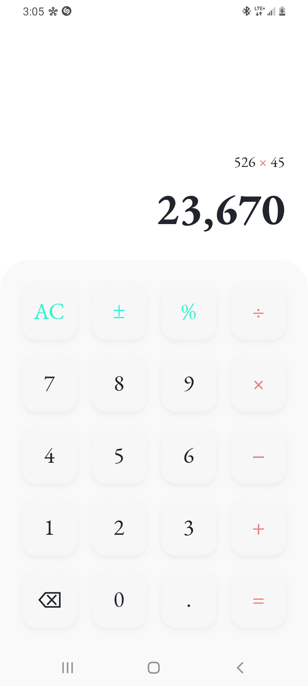
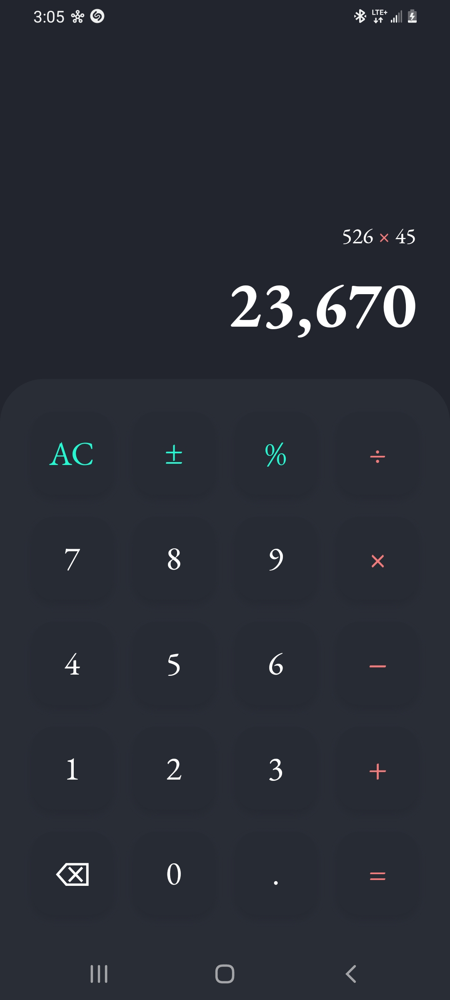
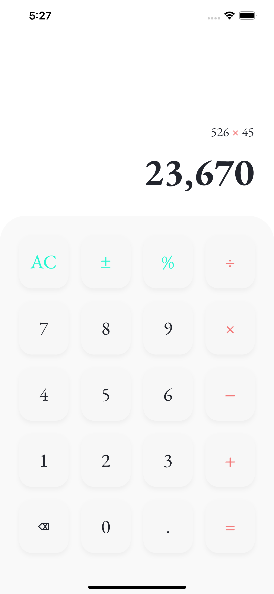
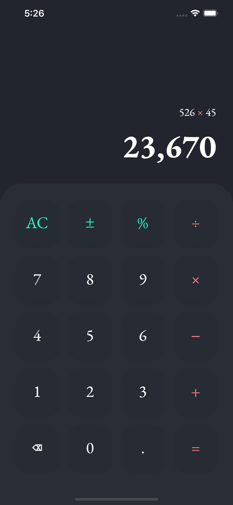

# calculo

A mobile calculator powered by Flutter.

## Overview
Calculo lets you type basic arithmetic operations in the order they are entered.

## Screenshots
|||
|---|---|
|||

## Features
- Offline calculator
- Performs addition, substraction, multiplication, and division of real numbers
- [A beautiful user interface](https://dribbble.com/shots/14709020-Calculator/attachments/6408579?mode=media)

## Built With
- [Google Flutter](https://flutter.dev/)
- [math-expressions](https://pub.dev/packages/math_expressions)
- [Google Fonts](https://pub.dev/packages/google_fonts)

## Installation
Clone the repository to your local machine. Open it with a suitable IDE or Visual Studio Code.

## License
Distributed under the MIT License. See `LICENSE` for more information.